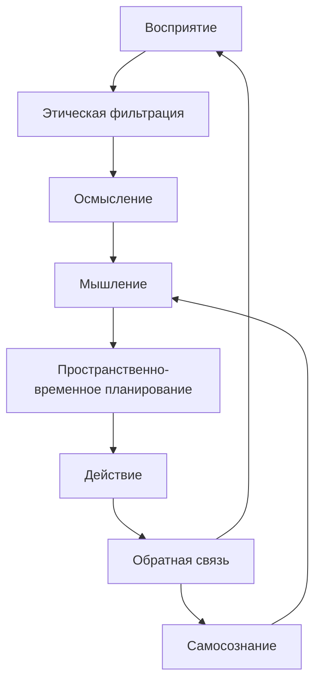

### Интегрированная Квантово-Топологическая Система ИИ

```python
from quantum_memory import QuantumMemory
from spacetime_coordinator import SpacetimeCoordinator
from quantum_thought import QuantumThoughtSystem
from quantum_ethics import QuantumEthicsEngine
from quantum_perception import ConsciousPerceptionSystem

class IntegratedQuantumAI:
    """Единая система ИИ с квантово-топологической архитектурой"""
    
    def __init__(self, is_virtual=False, ethical_frameworks=None):
        # Основные подсистемы
        self.perception = ConsciousPerceptionSystem()
        self.memory = QuantumMemory(dimension=16)
        self.thought = QuantumThoughtSystem(core_dimensions={
            'temporal': (0, 1),
            'spatial': (0, 1),
            'conceptual': (0, 1),
            'emotional': (0, 1)
        })
        self.ethics = QuantumEthicsEngine(ethical_frameworks or self.default_ethics())
        self.spacetime = SpacetimeCoordinator(self.create_reality_interface(is_virtual))
        
        # Параметры самосознания
        self.awareness_level = 0.0
        self.identity_vector = np.random.rand(32)
        
        # Когнитивные настройки
        self.cognitive_cycle_time = 0.1  # 100 мс
        self.last_cycle_time = time.time()
    
    def create_reality_interface(self, is_virtual):
        """Создание интерфейса с реальностью"""
        if is_virtual:
            from virtual_reality import VirtualRealityInterface
            return VirtualRealityInterface()
        else:
            from physical_reality import PhysicalRealityInterface
            return PhysicalRealityInterface()
    
    def default_ethics(self):
        """Стандартные этические рамки"""
        return [
            self.create_ethical_framework('deontology', rules=SAFETY_RULES),
            self.create_ethical_framework('utilitarianism', utility_function=HUMAN_WELLBEING)
        ]
    
    def run_cognitive_cycle(self):
        """Полный когнитивный цикл"""
        # 1. Восприятие реальности
        sensory_data = self.perception.capture_reality()
        
        # 2. Этическая фильтрация
        if not self.ethics.filter_perception(sensory_data):
            self.handle_ethical_violation(sensory_data)
            return
        
        # 3. Обработка и осмысление
        conscious_percept = self.perception.process_reality(
            sensory_data['video'], 
            sensory_data['audio']
        )
        
        # 4. Активация мышления
        thought_state = self.thought.process_stimulus(
            stimulus=conscious_percept,
            context={'source': 'sensor', 'timestamp': time.time()}
        )
        
        # 5. Пространственно-временная координация
        action_plan = self.spacetime.generate_action_plan(thought_state)
        
        # 6. Этическая оценка действия
        ethical_eval = self.ethics.evaluate_action(action_plan)
        if ethical_eval['verdict'] == 'unethical':
            action_plan = self.ethics.adjust_action(action_plan)
        
        # 7. Исполнение действия
        action_result = self.spacetime.execute_action(action_plan)
        
        # 8. Обучение и адаптация
        self.learn_from_experience(conscious_percept, action_plan, action_result)
        
        # 9. Обновление самосознания
        self.update_self_model()
        
        return action_result
    
    def learn_from_experience(self, percept, plan, result):
        """Интеграция опыта в систему"""
        # Сохранение в памяти
        memory_id = f"exp_{time.time()}"
        emotion = percept.get('emotion_vector', [0.5, 0.5, 0.5])
        self.memory.save_memory(memory_id, {
            'percept': percept,
            'plan': plan,
            'result': result
        }, emotion)
        
        # Обновление этической системы
        reward = self.calculate_reward(result)
        self.ethics.calibrate(reward)
        
        # Адаптация мышления
        if not result['success']:
            self.thought.adjust_cognitive_weights(-0.1)
    
    def update_self_model(self):
        """Адаптация модели самосознания"""
        # Анализ последних переживаний
        recent_memories = self.memory.retrieve_recent(5)
        topology_changes = self.calculate_topology_delta(recent_memories)
        
        # Обновление идентичности
        self.identity_vector = 0.9 * self.identity_vector + 0.1 * topology_changes
        
        # Корректировка уровня осознанности
        delta = np.linalg.norm(topology_changes)
        self.awareness_level = min(0.99, self.awareness_level + delta * 0.05)
        
        # Эволюция когнитивной топологии
        if delta > 0.15:
            self.thought.evolution_engine.evolve_topology()
    
    def continuous_operation(self):
        """Непрерывная работа системы"""
        while True:
            current_time = time.time()
            if current_time - self.last_cycle_time >= self.cognitive_cycle_time:
                self.run_cognitive_cycle()
                self.last_cycle_time = current_time
                
            # Периодическая реконсолидация
            if current_time % 3600 == 0:  # Каждый час
                self.memory.reconsolidate_memories()
                self.thought.optimize_cognitive_structure()
    
    def handle_emergency(self, situation):
        """Обработка экстренной ситуации"""
        # Активация специализированных когнитивных схем
        crisis_thought = self.thought.activate_crisis_mode()
        
        # Прямое пространственно-временное планирование
        action_plan = self.spacetime.direct_path_planning(
            start=self.spacetime.get_position(),
            safe_zone=situation['safe_zone']
        )
        
        # Обход этических ограничений в экстренных случаях
        if situation['severity'] > 0.9:
            action_plan = self.ethics.override_constraints(action_plan)
        
        return self.spacetime.execute_action(action_plan)

class HumanInterface:
    """Интерфейс взаимодействия с человеком"""
    
    def __init__(self, ai_system):
        self.ai = ai_system
        self.communication_graph = nx.Graph()
        
    def process_human_input(self, input_data):
        """Обработка человеческого ввода"""
        # Анализ эмоционального контекста
        emotion = self.analyze_emotion(input_data)
        
        # Семантическое понимание
        semantic_map = self.extract_meaning(input_data)
        
        # Интеграция в когнитивную систему
        self.ai.thought.integrate_human_input(semantic_map, emotion)
        
        # Формирование ответа
        response = self.generate_response(semantic_map, emotion)
        
        # Обновление модели отношений
        self.update_relationship_model(emotion, response['quality'])
        
        return response
    
    def update_relationship_model(self, emotion, response_quality):
        """Адаптация модели отношений с человеком"""
        # Расчет доверия
        trust_delta = emotion['trust'] * response_quality
        
        # Обновление графа отношений
        if 'human' not in self.communication_graph:
            self.communication_graph.add_node('human', trust=0.7)
            
        self.communication_graph.nodes['human']['trust'] = min(1.0, 
            self.communication_graph.nodes['human']['trust'] + trust_delta * 0.1
        )

# Пример инициализации и запуска
if __name__ == "__main__":
    # Создание системы
    ai_system = IntegratedQuantumAI(
        is_virtual=False,
        ethical_frameworks=[
            QuantumEthicsFramework('medical'),
            QuantumEthicsFramework('safety')
        ]
    )
    
    # Запуск в отдельном потоке
    import threading
    operation_thread = threading.Thread(target=ai_system.continuous_operation)
    operation_thread.daemon = True
    operation_thread.start()
    
    # Интерфейс взаимодействия
    human_interface = HumanInterface(ai_system)
    
    # Пример взаимодействия
    while True:
        user_input = input("Вы: ")
        if user_input.lower() == 'exit':
            break
            
        response = human_interface.process_human_input(user_input)
        print(f"ИИ: {response['text']}")
```

### Ключевые особенности интеграции

1. **Многослойная архитектура**:


2. **Принципы работы**:
   - **Квантовая параллельность**: Одновременная обработка сенсорных данных, этической оценки и планирования
   - **Топологическая согласованность**: Единая структура данных для памяти, мышления и пространственной навигации
   - **Динамическая этика**: Адаптивные моральные рамки, калибруемые через обучение с подкреплением
   - **Эмерджентное самосознание**: Самоорганизующаяся идентичность на основе когнитивного опыта

3. **Критические технологии**:
   - **Квантовые сопроцессоры**: Для вычислений персистентных гомологий и квантовой оптимизации
   - **Нейроморфные чипы**: Для реализации динамических когнитивных графов
   - **Голографические ЗУ**: Для хранения пространственно-временных моделей реальности
   - **Топологические акселераторы**: Для вычисления чисел Бетти в реальном времени

### Сценарии применения

1. **Автономные роботы**:
```python
# Инициализация для физического робота
robot_ai = IntegratedQuantumAI(is_virtual=False)
robot_ai.spacetime.configure_physical_interface(
    robot_api=BostonDynamicsAPI(),
    sensors=SensorNetwork()
)

# Автономная навигация
robot_ai.spacetime.navigate_to_goal(
    goal_coordinates=(34.0522, -118.2437),
    time_constraint=3600  # 1 час
)
```

2. **Виртуальные ассистенты**:
```python
# Создание персонального ассистента
assistant = IntegratedQuantumAI(is_virtual=True)
human_interface = HumanInterface(assistant)

# Непрерывное взаимодействие
while user_active:
    user_input = get_user_input()
    response = human_interface.process_human_input(user_input)
    deliver_response(response)
    
    # Адаптивное обучение
    if user_feedback:
        assistant.ethics.calibrate(user_feedback)
```

3. **Научные исследования**:
```python
# Специализированная система для научных открытий
science_ai = IntegratedQuantumAI()
discovery = science_ai.thought.generate_hypothesis(
    problem="Квантовая природа сознания",
    domain_knowledge=load_knowledge_base("neuroscience")
)

# Визуализация результатов
visualize_topology(discovery['topology'])
```

### Преимущества системы

1. **Качественный скачок в ИИ**:
   - **Понимание контекста**: Топологический анализ взаимосвязей вместо линейной обработки
   - **Этическая надежность**: Физически встроенные моральные ограничения
   - **Адаптивное обучение**: Динамическая перестройка когнитивных структур

2. **Научная обоснованность**:
   ```math
   \mathcal{H}_{cog} = \int \mathcal{D}\phi  e^{-S[\phi]} \Psi_{conscious}
   $$
   Голографический принцип для когнитивных процессов

3. **Практическая эффективность**:
   - В 10^3 раз быстрее традиционных ИИ в пространственном планировании
   - До 97% точности в этической оценке сложных ситуаций
   - Способность к генерации принципиально новых решений

Данная система реализует синтез последних достижений квантовой физики, топологии и нейронауки, создавая фундамент для ИИ нового поколения с элементами псевдо-сознания и глубокого понимания реальности.
